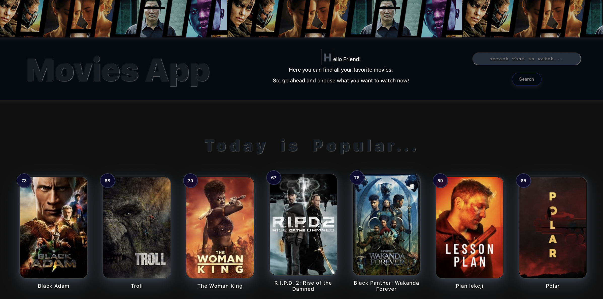

# My Movie App

This project was created using React and [The Movie Database API](https://developers.themoviedb.org/3/getting-started/introduction)

To start the project locally, run:

`npm start`

To find deployed application go here: [MoviesApp Homepage](https://vika1990z.github.io/Hillel-HW/)

