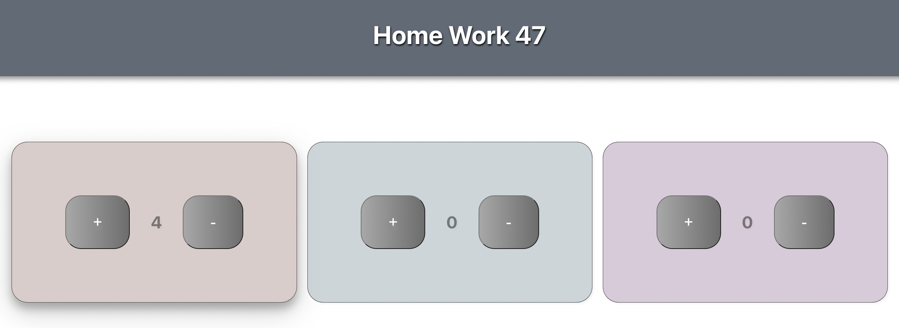

# Home work 47. Squares increment / decrement using React

My React App

To run, use:

`npm start`

### Верстка

Зробити три квадрати, усередині кожного з яких спочатку вписано цифру 0, додати щоб усередині квадратів були кнопки +/-.

### Логіка

При натисканні на "+", значення всередині квадрата збільшується, при натисканні на "-", зменшується відповідно.

### Реалізація

* необхідно створити компонент Square.   
* всередині повинен бути state що зберігає цифру.  
* при натисканні на кнопки необхідно міняти state.  
* використовувати тільки функціональні компоненти з хуками.  