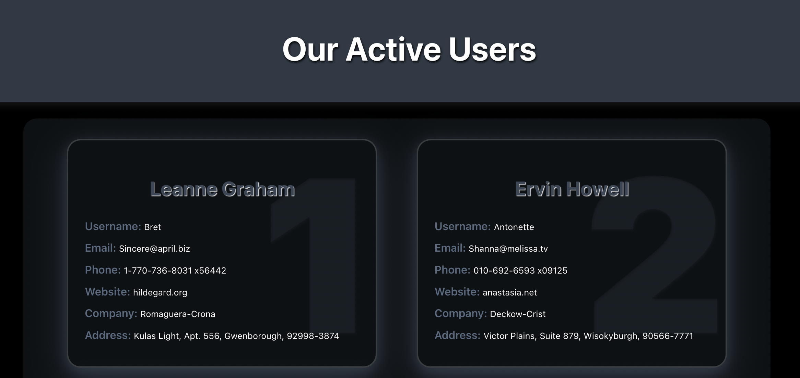

# Home work 45. Render users using React

My first React App

To run, use:

`npm start`

Лінк звідки взяти дані для рендеру користувачів -
https://jsonplaceholder.typicode.com/users  

Що потрібно зробити:    

* використовувати Create React App  
* відобразити користувачів на сторінці  
* використовувати компонентний підхід   
* візуально додати стилі, щоб відображалося нормально)  

