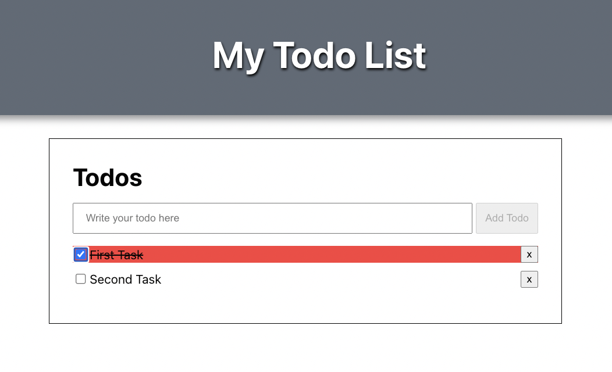

# Home work 46. Todos app

React App - class components

To run, use:

`npm start`

Що потрібно зробити:

* Стягнути собі те, що робили на уроці - https://github.com/roman-boyko/hillel-front-end-pro/tree/lesson-30/lesson/my-app  
* Додати функціонал виконаного завдання, у проекті вже є чекбокс для цього, але він просто не працює поки що. Як візуально відобразити вибір за вами. Я пропоную перекреслювати текст за допомогою стилів. Зміну чекбоксу потрібно реалізувати через стейт, для цього при створенні нового завдання потрібно додати в об'єкт checked, який потім можна буде витягнути всередині Item.   
* Наразі ми можемо додавати порожні завдання. Додати логіку щоб уникнути додавання порожніх завдань, тільки якщо щось ввели.

