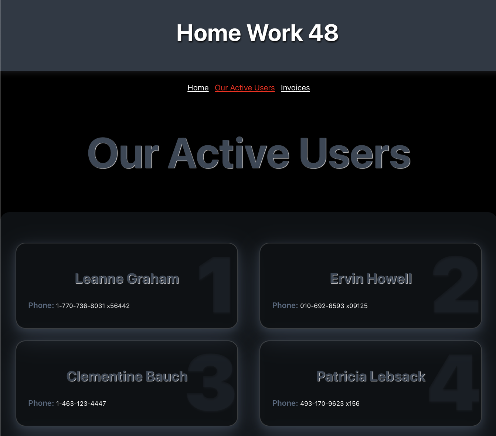

# Home work 48. Users app

Users React App

To run, use:

`npm start`

### Короткий опис

Створити програму, в якій будуть відображатися користувачі та детальна інформація про них. Реалізувати навігацію сторінками через ReactRouter.

### Детальний опис
  
* Необхідно реалізувати 4 роути.    
* На шляху "/" - відобразити головну сторінку. Там має бути якийсь заголовок, можна невеликий текст, що описує, що це за додаток. Також має бути лінк на сторінку зі списком користувачів.  
* На шляху "/users" - відобразити список користувачів. Верстку можна взяти з
  попередніх робіт, або створити спочатку, як зручно. Дані для рендеру взяти за
  цим ендпоінтом. При переході на цю сторінку потрібно надіслати запит на сервер
  і коли дані будуть отримані відмалювати користувачів. Також у кожного
  користувача має бути лінк на детальну інформацію про нього. 
* На шляху "/users/:userId" - відобразити ділову інформацію про користувача.
  Дані для рендеру взяти за цим ендпоінтом. При переході на цю сторінку потрібно
  надіслати запит на сервер і коли дані будуть отримані відмалювати інформацію.
  Також у кожного користувача має бути лінк назад, на список усіх користувачів. 
* По шляху якого немає, наприклад "/error" - відобразити інформацію про помилку 404.    
